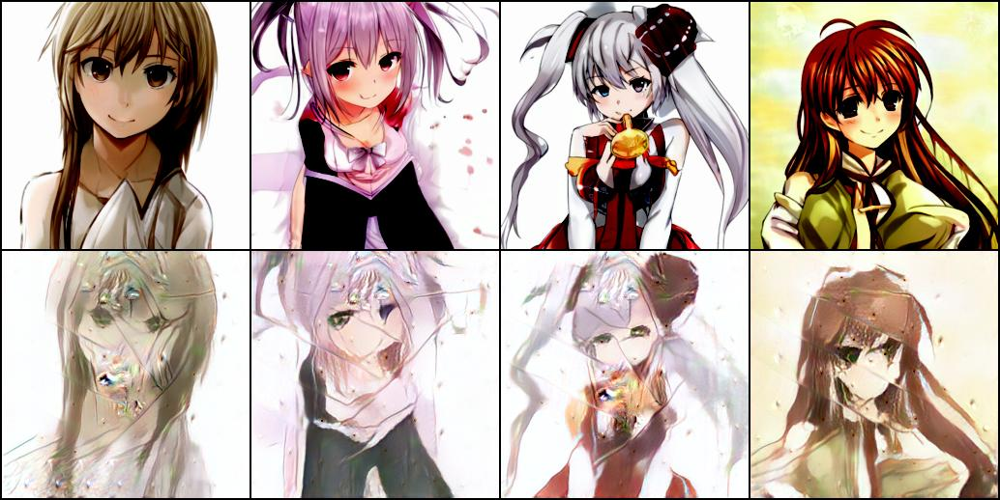
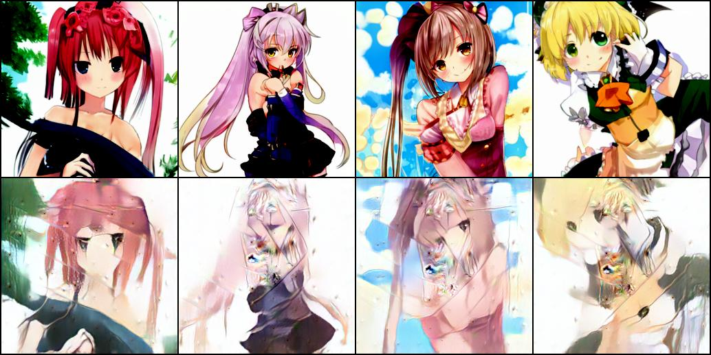

<h1 align="center">
  <b>VQGAN</b><br>
</h1>


This project is for **personal learning and experimentation**, containing implementations of **VQGAN**.

> 🔗 The code is primarily adapted from [dome272's VQGAN-pytorch repository](https://github.com/dome272/VQGAN-pytorch).
>
> 🎨 The dataset used is from This Anime Does Not Exist, which provides high-quality AI-generated anime portraits. These synthetic images are used for training and evaluation purposes in this project.


# Requirements

- Python (any version)
- PyTorch (any version)
- CUDA enabled computing device

# Results

📊 Below is a comparison between the performance of our model and that of the original repository. Although I used the exact same hyperparameters, my results are noticeably worse. I believe the primary reason is the quality of the dataset.

**PS:** The dataset I downloaded is actually quite noisy—but I really just wanted an anime dataset, haha.

## First Stage (Reconstruction):

### 50 Epoch(Dome272's VQGAN):


### 46 Epoch(My VQGAN):


## Second Stage (Generating new Images):

Original Left | Reconstruction Middle Left | Completion Middle Right | New Image Right

### 50 Epoch(Dome272's VQGAN):



### 46 Epoch(My VQGAN):


# Train VQGAN:

### Training First Stage

```python train_vqgan.py```

### Training Second Stage

```python train_transformer_vqgan.py```


# Citation

```bibtex
@misc{esser2021taming,
      title={Taming Transformers for High-Resolution Image Synthesis}, 
      author={Patrick Esser and Robin Rombach and Björn Ommer},
      year={2021},
      eprint={2012.09841},
      archivePrefix={arXiv},
      primaryClass={cs.CV}
}
```


